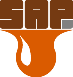
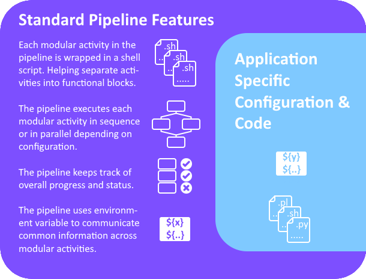

## simple-action-pipeline (SAP)

A simple pipeline framework for implementing scheduled sequential and parallel actions. Designed around two simple configuration files and implementation of an uncomplicated workflow manager. The simple action pipeline uses the python package "[**Jug**](https://jug.readthedocs.io/en/latest/)" as it's underlying workflow manager. 

The simple action pipeline has some standard features which wrap around any application specific configuration or code.  



##  

### Installation
It is recommended that the sap package is installed and used within a Python virtual environment. The Python version must be >= 3.9.x .  

To create a Python virtual environment:  
```
python -m venv path_to_new_virtual_env
```
  
Then activate the python virtual environment:  
```
source path_to_new_virtual_env/bin/activate
```  

Once activated, install the sap package and it's dependencies into the python virtual environment:  
```
git clone https://github.com/antarctica/simple-action-pipeline ./simple-action-pipeline
cd ./simple-action-pipeline
pip install -e .
```  

You may wish to create a symbolic link to the virtual python environment for your pipeline:  
```
ln -s <path-to-python-venv>/activate <pipeline-directory>/activate
```
This way you can easily locate and activate the virtual environment for specific pipelines.

##  

### Usage
A simplified implementation of a simple-action-pipeline is given in the `example` folder. Two yaml files in the `example` folder are used to configure the pipeline and the 'application specific' scripts are in the `example/scripts` folder.
```
ls -ahl ./example
```

Check the help of the `pipeline` command-line tool:
```
pipeline --help
```
> **The standard usage for the pipeline command-line tool is:**  
> **`pipeline` `{options}` `[action]` `[target_directory]`**  

##  

### Running for the first time
The example pipeline (and any pipeline for that matter) must be built before it can be used.  

The action `build` will construct the pipeline from the configuration files.

```
pipeline build ./example
```
The example pipeline should build without any errors.  

Once built you can check the status of the, now built, pipeline:
```
pipeline status ./example
```

##  

### Executing the pipeline
The action `execute` is used to run the pipeline from start to finish. The pipeline will spawn a maximum number of 'workers' as defined in **pipeline.yaml**. The maximum number of workers should be set to how many scripts will run in parallel within the pipeline. For the example pipeline this is 2 workers.  

```
pipeline execute ./example
 - or -
pipeline execute ./example > ./example/log.txt
```
As shown above, you can re-direct the output of the pipeline to a log file.

##  

### Checking the pipeline status
The action `status` is used to check the current state of the pipeline.

```
pipeline status ./example
 - or -
pipeline status ./example --short
```
The action `status` can also present the current state of the pipeline in short form by using the '--short' flag.  
The status of the pipeline persists even once the pipeline is complete, which allows checking the pipeline hours, or even days after completion.  

##  

### Resetting the pipeline
Because the pipeline state persists after completion (or failure) it must be `reset` before it can be executed again. Trying to execute a completed pipeline will result in no execution as all the work has already been done.  

> ```
> pipeline execute ./example
> 
> INFO:pipeline:All Tasks complete, nothing to do
> INFO:pipeline:Use the [reset] action before re-executing a completed pipeline
> ```
The action `reset` resets the pipeline back to it's un-executed state.  

```
pipeline reset ./example
```

##  

### Halting a running pipeline
The action `halt` stops and destroys all of the workers on a pipeline.

```
pipeline halt ./example
```
The status of the pipeline will remain static beyond this point and show only scripts/tasks which successfully completed in full.  

The pipeline will allow re-execution from this point by issuing the `execute` action. The pipeline will commence from it's last successfully completed task(s).  

The pipeline can also be `reset` follwing a `halt` action to start it from the beginning again.  

##  

## Contributing
If you find a bug, or would like to contribute please raise an issue in the first instance.
