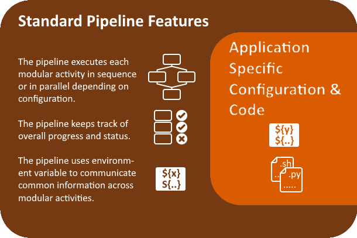

A simple pipeline framework for implementing sequential, parallel and dependant actions. Designed around two yaml configuration files and implementing an uncomplicated workflow manager. The simple action pipeline uses the python package "[**Jug**](https://jug.readthedocs.io/en/latest/)" as it's underlying workflow manager and is provided as a pip installable python3 package. 

The simple action pipeline has some standard features which wrap around any application specific configuration or code.  

